* Table of Contents
{:toc}
--------------------------------------------------------------------------------------------------------------------
## 1. Introduction
**OneShelf** is a desktop application for you to manage your restaurant inventories. Additionally, you can also
keep track of deliveries that has yet to be delivered to customers.
It is easy to build and customise your inventories and deliveries by using
only Command Line Interface. If you are a restaurant manager
who prefers to use the Command Line Interface and needs to keep
track of inventory items and pending deliveries, **OneShelf** is for you.
  
This User Guide will provide a general overview of installation, current features, and a sneak peek for upcoming features.

--------------------------------------------------------------------------------------------------------------------

## 2. Quick Start

### 2.1 Installation Guide

Refer to this video for a quick tutorial on **OneShelf Installation Guide**:
 

 

Installation Steps:
1. Ensure you have Java `11` or above installed in your Computer.

1. Download the latest `oneshelf.jar` from [here](https://github.com/AY2021S1-CS2103T-T12-1/tp/releases).

1. Copy the file to the folder you want to use as the _home folder_ for this application.

1. Double-click the file to start the app. If you are unable to open the file by double-clicking, 
you may want to install 
[Java SE Platform](https://www.oracle.com/sg/java/technologies/javase-downloads.html) or you can also open **OneShelf**
using the terminal, refer to the installation guide video above.

1. Refer to the [Features](#3-features) below for details of each command.

   
### 2.2 How to use OneShelf

**OneShelf** has 2 main components, namely are:
1. Inventory items
2. Pending deliveries

From here onwards, the term `item` and `delivery` are used specifically for inventory items and pending deliveries respectively.

#### Inventory items

Inventory items are the items that you want to keep track in your restaurant. The input for inventory items are flexible,
so that you can define the items according to your needs.  

`Name` and `Supplier` are used to uniquely identify an inventory item.

You can keep track of restaurant items such as chair, frying pan, spoon or even ingredients such as milk, chicken, etc.  

All items related commands have a suffix `-i`. 

#### Pending deliveries

Pending deliveries are deliveries that has yet to be delivered out to customers. Imagine you have received a call from
a customer requesting for a delivery, you can also keep track for all the deliveries' request.  

All delivery orders are unique.
You are able to add multiple delivery orders from the same `Name`, `Phone` and `Address`. There is no duplication in
pending deliveries, unlike inventory items.  
*Reason: A person have ordered from the restaurant. 10 minutes later, the same person called again to add 
a new order. Therefore, we allow you to add different orders even if `Name`, `Phone` and `Address` are already in
the list.*

All pending deliveries related command have a suffix `-d`.

### 2.3 User Interface Sections

* Once you have opened OneShelf application, similar GUI shown below (Figure 1) should appear.  
     *Note how the app contains some sample data but the installed version on your desktop might have a different data set.*
    
      
    
    
      
   Figure 1: Introduction to OneShelf User Interface
    
    
   

| Component | Description |
|-----------|-------------|
| Toolbar | Displays the toolbar options for this application. You can access the different `help` windows and `exit` the application.|
| Inventory book | Shows the list of inventory items that you have |
| Delivery book | Shows the list of pending deliveries that you have |
| Result Display | Displays the result of your command |
| Command box | For users to type their commands |
| Date time | Displays the date time at the current moment of viewing |

*You may want to refer to the [glossary](#6-glossary)*

 

   
* Type the command `help start` in the command box and press Enter to execute it.  
   A new help window shown below (Figure 2) should appear on your desktop. You are strongly encouraged to follow
   the steps in the help window if you are a new user.
     
    
    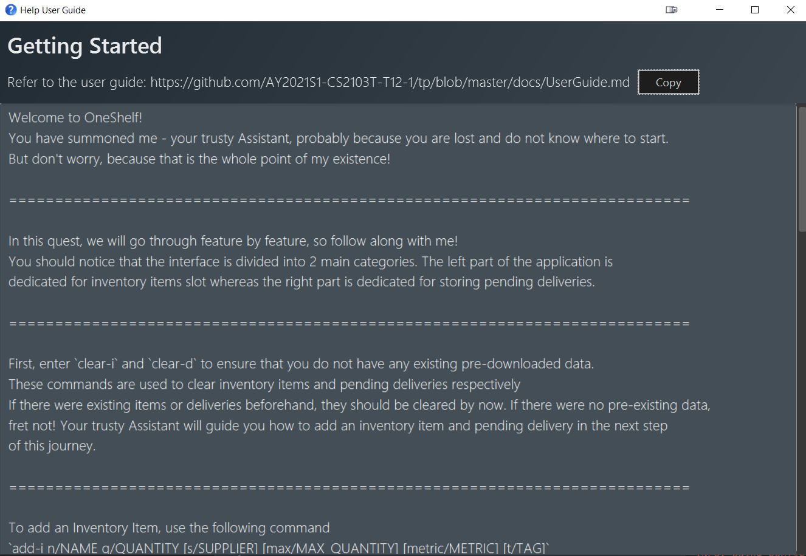
     
    
    Figure 2: Help Start Window
     

--------------------------------------------------------------------------------------------------------------------

## 3. Features

In this section, you can find the different available command features, general features 
and upcoming features.

### 3.1 Command Features

Things to note for the commands:
* Commands with suffix of `-i` refer to `item` related commands, while those with suffix of `-d` refer to `delivery` related commands.  
  e.g. `add-i` is used to add an `item` and `add-d` is used to add a `delivery`
  
  
* In the format of commands, `INDEX` refers to the numbering that is displayed.
    
  
  
   
  
  Figure 3: Index Annotation
   

* In the format of commands, words in `UPPER_CASE` are what you would input. 
  e.g. for a command with format `add-i n/NAME q/QUANTITY`,  
  replace `NAME` and `QUANTITY` with your input: `add-i n/Chicken q/10`.

* In the format of commands, square brackets are to indicate optional fields. The fields in the square brackets are not mandatory to input. 
  e.g a command with format `n/NAME [t/TAG]` can be used as 
  1. either `n/Chicken t/Poultry` 
  1. or just `n/Chicken`

* Items with `…`​ after them can be used multiple times in the same command or not at all. 
  e.g. `[t/TAG]…​` can be used 
  1. once: `t/brother`
  1. or multiple times: `t/sibling t/brother t/family`
  

* Fields in the commands can be in any order. 
  e.g. a command with format `add-i n/NAME q/QUANTITY` can be used as
  1. either `add-i n/Chicken q/10`
  1. or `add-i q/10 n/Chicken`
  
* If you add multiple inputs of the same parameter in a single command, OneShelf will take in the last parameter
as the actual input.  
  e.g. `add-i n/Chicken q/10 n/Fish`  
  Notice that in this example, `NAME` appears twice in one single command, OneShelf will take Fish as the actual
  name and ignore Chicken.
  
* The `|` symbol means the user must provide at least one of the fields separated by the `|`

#### 3.1.1 Viewing help : `help`

##### 3.1.1a `help start`

If you are a first time user, we strongly encourage you to follow the guide to kick-start your journey in **OneShelf**.

Format: `help start`

To open up `help start` window, you can also do the following:
* Press `F1` at any point in the usage of the app
* Click on `Help` located at the top toolbar and then click `Start F1`

A new help window similar to [Figure 2](#uihelpstart) should appear on your desktop.

##### 3.1.1b `help summary`

We understand that even if you are not a first time user, it is not easy to remember all the commands.
Should you require any quick reference of commands, you can enter `help summary`.

Format: `help summary`

To open up `help summary` window, you can also do the following:
* Press `F2`
* Click on `Help` located at the top toolbar and then click `Summary F2`
    
A new help window similar below (Figure 4) should appear on your desktop.

 

 

Figure 4: Help Summary Window
 

#### 3.1.2 Adding an item or delivery: `add-i` or `add-d`

Adds inventory item or pending delivery to **OneShelf**.

##### 3.1.2a `add-i`

Format: `add-i n/NAME q/QUANTITY [s/SUPPLIER] [max/MAX_QUANTITY] [metric/METRIC] [t/TAG]...​`

Pointers to take note when adding an item:

* If item does not exist in the inventory book, then a new item will be added.
* If similar inventory item already exist, then the `QUANTITY` of that particular item will be increased.
* An item which has the same `NAME` and `SUPPLIER` is considered similar.
* `MAX_QUANTITY` denotes the ideal stock level of that particular item.
* `TAG` could be used to categorise items. EG: Duck can be tagged as meat.

*Note: `MAX_QUANTITY` is not a hard cap on the amount of an item you can store in the inventory.* 

Example 1: Add an item using [Figure 1](#uiwithannotationpng) data set as the starting point.

1. Type `add-i n/DUCK q/10 s/NTUC max/50 metric/KG t/meat t/food` in the [Command Box](#uiwithannotationpng).

2. Either press Enter on your keyboard or click Send to execute the command.

3. The new item will show up in Inventory Book, refer to Figure 5:
     
    
    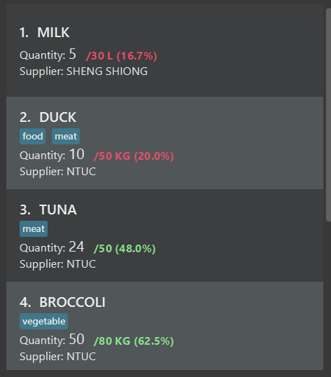
     
    
    Figure 5: Add new item of duck
     

4. Press key arrow up on your keyboard to toggle to previous command and press Enter. 
   You should receive an error message, refer to Figure 6:
     

    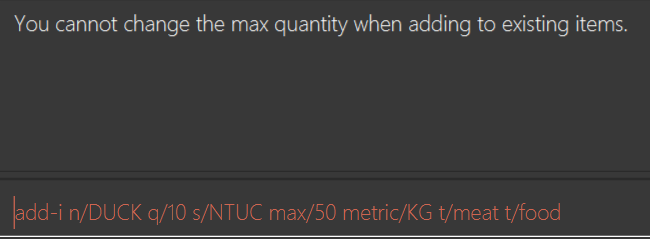
     
    
    Figure 6: Error for invalid input
     
 
    Your command should not pass through as you are not allowed to add an existing item with max quantity and metric.
    
   *Note: If you want to edit the maximum quantity or metric of an existing item, refer to [edit](#edit) feature*

5. Repeat step 1 and 2 above but with the command: `add-i n/DUCK q/10 s/NTUC t/perishable`. 
   You can refer to Figure 7 for the expected result:
     
    
    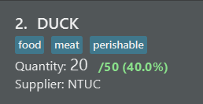
     
    
    Figure 7: Successfully added quantity with new tag
    
    Notice that you 
    are adding to an existing `item` DUCK which was just added. A new tag of perishable should also appear.
    
    

:bulb:**Tip:**  
An item can have any number of tags (including 0) and adding exactly the same tag to an existing item will not result in duplicated tags

##### 3.1.2b `add-d`

Format: `add-d n/NAME p/PHONE a/ADDRESS o/ORDER [by/TIME]`

Pointers to take note when adding a delivery:
* You can add a delivery even if the same `Name`, `Phone` and `Address` already exists in the delivery book.
* Unit of `Time` is minutes ie. `add-d n/JASON p/91111111 a/Blk 251 Orchard Road o/Nasi goreng x1 by/15` indicates
that this order needs to be delivered out in 15 minutes.

Example 1: 

1. Type `add-d n/JASON p/91111111 a/Blk 251 Orchard Road o/Nasi goreng x1`.

2. Either press Enter on your keyboard or click Send to execute the command.

3. You should now see a new pending delivery with a default `deliver by` of 30 minutes,
 you may want to refer to Figure 8:
     
    
    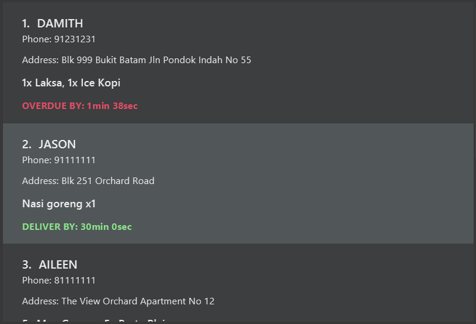
     
    
    Figure 8: Added Jason's delivery
     

Example 2: 

1. Repeat step 1 and 2 as above but with the command:
 `add-d n/HUGO p/91123421 a/Blk 253 BUKIT TIMAH o/Fish fillet x1 by/10`.

2. You should now see a Hugo's delivery with `deliver by` of 10 minutes,
 you may want to refer to Figure 9 below:
     
    
    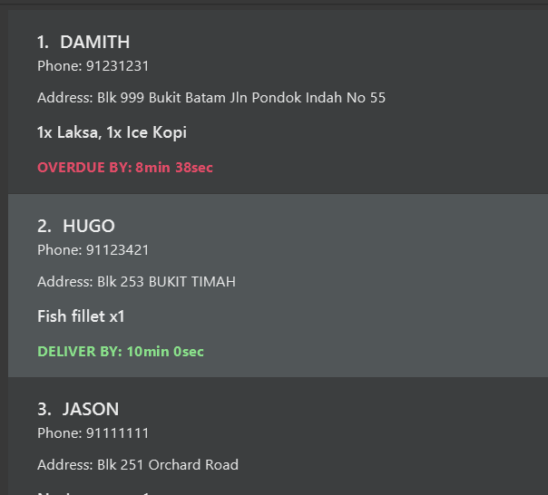
     
    
    Figure 9: Added Hugo's delivery
     

:bulb:**Tip:**  
Pending deliveries are automatically sorted based on their `deliver by` time and unlike inventory item, pending delivery does not have a quantity

#### 3.1.3 Removing quantity from an item: `remove-i`

Removes a specified quantity of an existing item from **OneShelf**.

Format: `remove-i INDEX q/QUANTITY`

Pointers to take note when removing an item's quantity:
* Subtracts `QUANTITY` from the current quantity of an item at the specified `INDEX`.
The [index](#index) refers to the index number shown in the displayed item list. The index **must be a positive integer** 1, 2, 3, …​

Examples:
* `remove-i 1 q/10`

:bulb: **Tip:**  
There is no remove-d since a pending delivery does not have a quantity

#### 3.1.4 Editing an item or delivery: `edit-i` or `edit-d`

Edits an existing item in the Inventory book or an existing pending delivery in the Delivery book.

##### 3.1.4a `edit-i`

Format: `edit-i INDEX [n/NAME | q/QUANTITY | s/SUPPLIER | max/MAX_QUANTITY | t/TAG…​]`

Pointers to take note when editing an item:

* Edits the item at the specified `INDEX`. The index refers to the index number shown in the displayed item list. The index **must be a positive integer** 1, 2, 3, …​
* Updates the components of an item.
* When editing tags, the existing tags of the item will be removed
* You can remove all the item’s tags by typing `t/` without
    specifying any tags after it.

Example 1: `edit-i 3 n/CARROTS q/50` using [Figure 1](#uiwithannotationpng) as the starting point.

1. Select the Command Box and type in `edit-i 3 n/CARROTS q/50`.

2. Either press Enter on your keyboard or click Send to execute the command.

3. Success Message will be shown in the Result Display and the 3rd item will show up with its updated fields,
refer to Figure 10.
     
    
    
     
    
    Figure 10: Edit Carrot Result
     

Example 2: `edit-i 2 n/Spinach t/` using [Figure 1](#uiwithannotationpng) as the starting point.

1. Select the Command box and type in `edit-i 2 n/Spinach t/`

2. Either press Enter on your keyboard or click Send to execute the command.

3. Success Message will be shown in the Result Display and the 2nd item will show up with its updated 
fields as shown in Figure 11.
     
    
    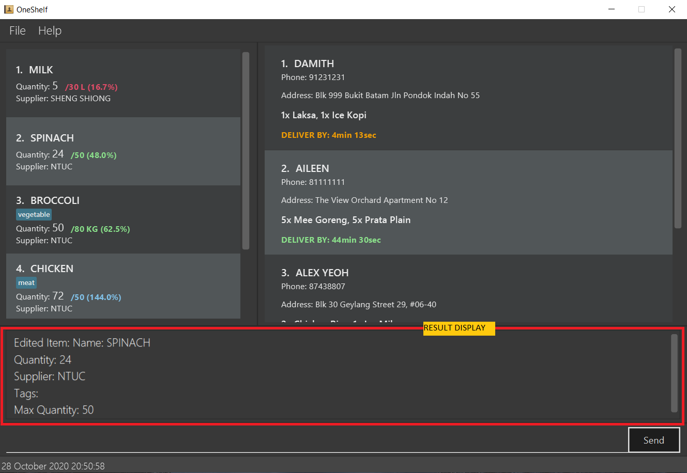
     
    
    Figure 11: Edit Spinach Result
     

##### 3.1.4b `edit-d`

Format: `edit-d INDEX [n/NAME | p/PHONE | a/ADDRESS | o/ORDER | by/TIME]`

Examples:
* `edit-d 1 n/AARON p/91111233`  
Edits the name and phone number of the 1st item to be `AARON` and `91111233` respectively.

#### 3.1.5 Locating items or delivery by keywords: `find-i` or `find-d`

Finds items or deliveries whose attributes contain any of the given keywords.

##### 3.1.5a `find-i`

Format: `find-i [n/NAME | s/SUPPLIER | t/TAG…​]`

Pointers to take note when finding an item:

* The search is case-insensitive. e.g `chicken` will match `CHICKEN`
* The order of the keywords does not matter. e.g. `Chicken steak` will match `steak Chicken`
* `Name`, `Supplier` and `Tag` can be searched
* Only full words will be matched e.g. `chicke` will not match `chicken`
* Items matching at least one keyword will be returned (i.e. `OR` search).
  e.g. `chicken steak` will return `chicken steak`, `steak beef`
* More than one Prefix can be specified (i.e. `AND` search).
  e.g. `find-i n/Chicken s/NTUC` will return items matching name and supplier.
* Finding multiple `Tag` needs to be seperated e.g. `find-i t/meat t/perishable`

Example:
* `find-i s/ntuc t/meat` using [Figure 1](#uiwithannotationpng) as the starting point.

1. Select the Command Box and type in `find-i s/ntuc t/meat`.

2. Either press 'Enter' on your keyboard or click Send to execute the command.

3. Success Message will be shown in the Result Display, and the number of matches will be shown. Refer to 
Figure 12:
     
    
    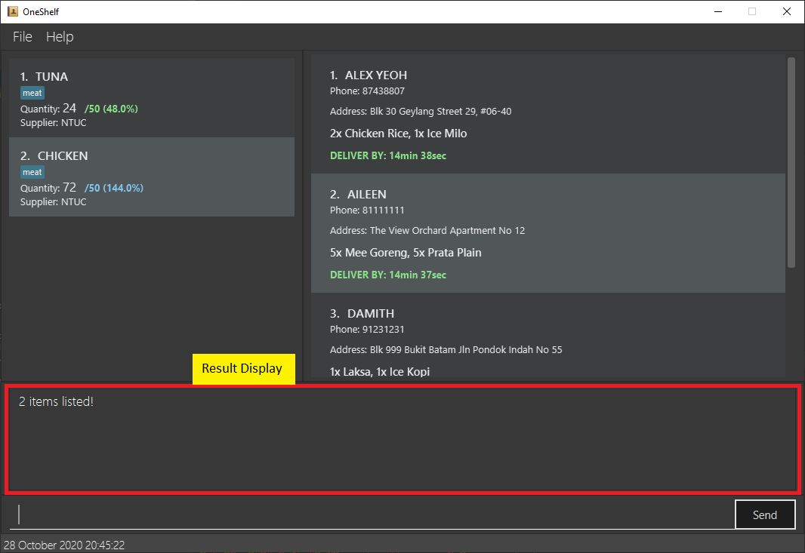
     
    
    Figure 12: Find item supplied by NTUC in meat category
     

##### 3.1.5b `find-d`

Format: `find-d [n/NAME | p/PHONE | a/ADDRESS | o/ORDER]`

Pointers to take note when finding a delivery:

* The search is case-insensitive. e.g `john` will match `JOHN`
* The order of the keywords does not matter. e.g. `John Lim` will match `Lim John`
* `Name`, `Phone`, `Address`, `Order` can be searched
* Only full words for name will be matched e.g. `Bob` will not match `Bobby`
* Any phone/address/order containing the search string within them will be matched. 
  * searching for "a/Holland V" will match "Holland Village"
  * searching for "p/123" will match "12345678"
* Items matching at least one word in the search query will be returned.
  e.g. `find-d n/Bernice Adam` will return deliveries with names `Bernice Yeo`, `Adam Tan`
* More than one Prefix can be specified (i.e. `AND` search).
  e.g. `find-d n/Bernice p/85783742` will return delivery matching *both* name and phone.

Example:
* `find-d n/alex aileen` using [Figure 1](#uiwithannotationpng) as the starting point.

1. Select the Command Box and type in `find-d n/alex aileen`

2. Either press 'Enter' on your keyboard or click Send to execute the command.

3. Success Message will be shown in the Result Display, and the number of matches will be shown. Refer to Figure 13:
     
    

    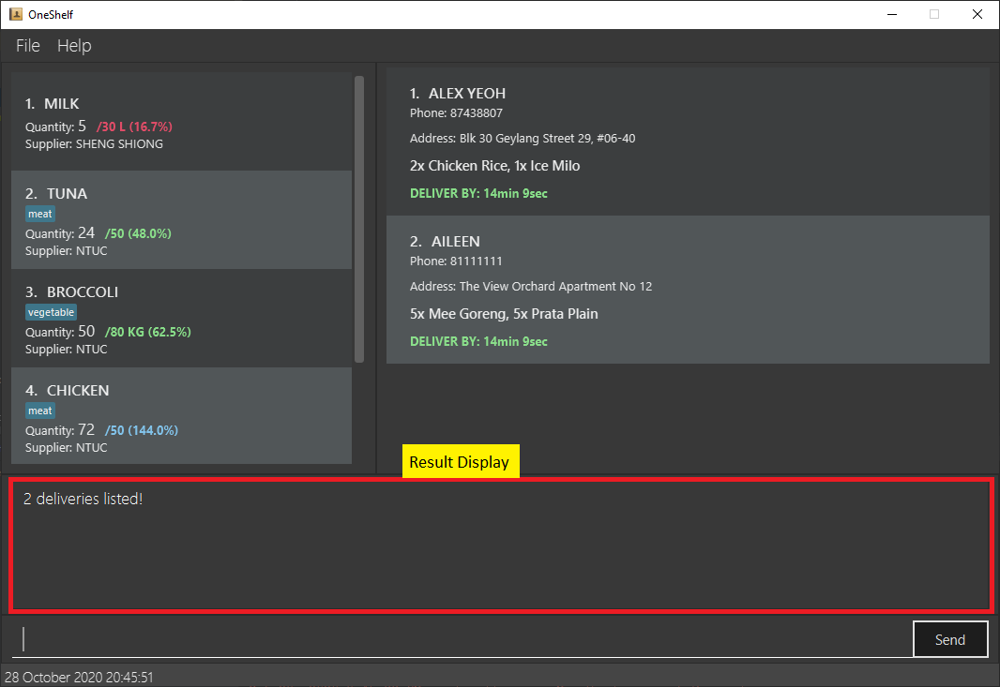
     
    
    Figure 13: Find delivery by alex and aileen
     

#### 3.1.6 Listing all items or delivery: `list-i` or `list-d`

After entering `find-i` or `find-d`, the placeholder in your application will only show the items or deliveries
that match your find KEYWORD. If you would like to show **all** the items and deliveries again,
`list-i` or `list-d` command would be useful.

Format: `list-i` or `list-d`

Example: 
* `list-i` using the result of [find example](#findexample1) as a starting point.

1. Select the Command Box and type in `list-i`.

2. Either press 'Enter' on your keyboard or click Send to execute the command.

3. Success Message will be shown in the Result Display, refer to Figure 14:
     
    
    
     
    
    Figure 14: List inventory items
     

#### 3.1.7 Deleting an item or delivery: `delete-i` or `delete-d`

Deletes an item or delivery from inventory book or delivery book respectively. Delete command is especially useful
for delivery as you would often need to delete a pending delivery once it has been delivered.

Format: `delete-i INDEX` or `delete-d INDEX`

Pointers to take note when deleting an item or delivery:

* Deletes an item or delivery at the specified `INDEX`.
* The index refers to the index number shown in the displayed item/ delivery list.
* The index **must be a positive integer** 1, 2, 3, …​

Example 1:
1. Assume by entering `list-i`, we have the following inventory items as shown in Figure 15:
     
     
    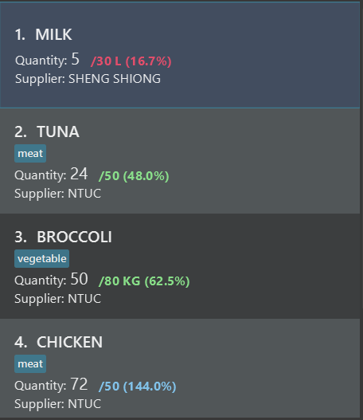
     
    
    Figure 15: Before deleting index 2
     

2. Enter `delete-i 2` which will delete the 2nd INDEX in the inventory book. The expected result should be as shown in Figure 16:
     
    
    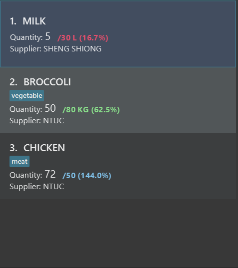
     
    
    Figure 16: After deleting index 2
     

:bulb: **Tip:**  
`delete-d` behaves similarly to `delete-i`, but deletes a delivery instead of an inventory item

#### 3.1.8 Clearing all entries: `clear-i` or `clear-d`

Clears all entries from the Inventory/ Delivery book.

Format: `clear-i` or `clear-d`

#### 3.1.9 Undo last command: `undo`

Undoes the previous command by reverting the current data displayed to the state it was in before the last command was executed.

Format: `undo`

Pointers to take note about `undo`:

* If there is a previous state available, the current state is reverted to that state
* If the current state is the earliest possible one, it shows a message informing the user that there is nothing more to undo
* The maximum number of previous commands you can undo is 20

Example 1: `undo` using [Figure 1](#uiwithannotationpng) as the starting point.

1. Select the Command box and type in `clear-i`

2. Either press Enter on your keyboard or click Send to execute the command.
     
    
    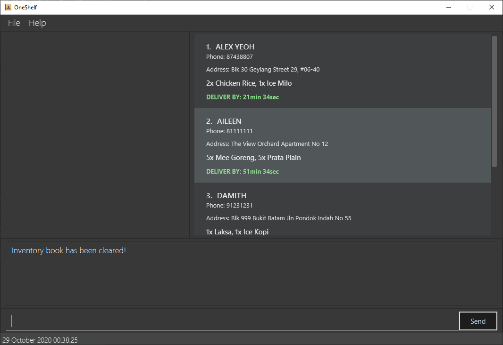
     
    
    Figure 17: Clear all items
     

3. Select the Command box and type in `undo`

4. Repeat step 2
* You should now see the same items as appearing in [Figure 1](#uiwithannotationpng)

#### 3.1.10 Redo last command: `redo`

Redoes the last undone command by reverting the current data displayed to the state it was in before the last undo command was executed.

Format: `redo`

Pointers to take note about `redo`:

* If there is an undone state available, the current state is reverted to that state
* If the current state is the latest possible one, it shows a message informing the user that there is nothing more to redo
* After any command that changes the state of data (such as add, clear, delete, edit), the new state becomes the latest state
(i.e. the previous undo commands are "forgotten" and `redo` will have no effect)

Example 1: `redo` using [Figure 1](#uiwithannotationpng) as the starting point.

1. Follow steps 1 - 4 of [Example 1](#undoExample1) for the `undo` command

2. Select the Command box and type in `redo`

3. Either press Enter on your keyboard or click Send to execute the command

4. You should now see the items cleared again, as shown in [Step 2 of Example 1](#undoExample1Step2) of the `undo` command.

#### 3.1.11 Exiting the program: `exit`

Exits the program.

Format: `exit`

### 3.2 General Features

#### 3.2.1 Saving the data

**OneShelf** data are saved in the hard disk automatically after any command that changes the data. There is no need to save manually.

#### 3.2.2 Scrolling through command history

**OneShelf** commands are traversable (up to 20 commands) much like Window's command prompt. 
By pressing the arrow up key traversing you're able to traverse previous commands and 
by pressing the arrow down key you're able to traverse into next commands.

#### 3.2.3 Sorting

##### 3.2.3a Sorting Inventory Items

* Inventory items are sorted based on percentage of quantity in ascending order.
* If the maximum quantity does not exist for that particular item then the item will be located at the end of the list.
* If 2 items have the same quantity, they are then sorted lexicographically.

##### 3.2.3b Sorting Pending Deliveries

* Pending deliveries are sorted based on deliver by timing ie. delivery by.

### 3.3 Coming Soon

#### 3.3.1 Statistics `[Coming Soon]`

Prints the total amount of delivery and reservation for the day

#### 3.3.2 Scheduling `[Coming Soon]`

Allows user to know when to do restocking

#### 3.3.3 Prices of items `[Coming Soon]`

Look up prices on a 'supplier' database

#### 3.3.4 Notification `[Coming Soon]`

Notify the user if a certain stock is below threshold

--------------------------------------------------------------------------------------------------------------------
## 4. FAQ

**Q**: How do I transfer my data to another Computer?  
**A**: Install the app in the other computer and overwrite the empty data file it creates with the file that contains the data of your previous Inventory/ DeliveryBook home folder.

**Q**: I am unable to open up the application by double clicking on oneshelf.jar file, what should I do?  
**A**: If double clicking does not work, you may use the command prompt to open **OneShelf**.
You may refer to the [video](#installationvideo) of installation guide.

**Q**: Help! I've accidentally typed `clear-i` or `clear-d` and wiped all my data!  
**A**: Use the [Undo Command](#3110-undo-last-command-undo) to reset your data back.

--------------------------------------------------------------------------------------------------------------------

## 5. Command Summary

#### 5.1 General Commands Summary

| Action    | Format, Examples                                                                                    |
|-----------|-----------------------------------------------------------------------------------------------------|
|**Get help to start off**    | `help start` or press `F1` or use GUI help menu at the top left |
|**Get help summary**    | `help summary` or press `F2` or use GUI help menu at the top left |   
|**Undo last command**   | `undo`  |
|**Redo last undone command**   | `redo`  |
|**Exit command** | `exit` |

#### 5.2 Inventory Summary

| Action    | Format, Examples                                                                                    |
|-----------|-----------------------------------------------------------------------------------------------------|
|**Add to Inventory**    | `add-i n/NAME q/QUANTITY [s/SUPPLIER] [max/MAX_QUANTITY] [metric/METRIC] [t/TAG]...​`   e.g., `add n/Chicken q/3 s/ShengSiong t/Poultry` |
|**Clear from Inventory**  | `clear-i`            |
|**Delete from Inventory** | `delete-i INDEX`  e.g., `delete 3`         |
|**Edit Inventory**   | `edit-i INDEX [n/NAME | q/QUANTITY | s/SUPPLIER | max/MAX_QUANTITY | t/TAG…​]`   e.g.,`edit 1 n/Chicken q/50`    |
|**Find in Inventory**   | `find-i [n/NAME | s/SUPPLIER | t/TAG…​]`   e.g., `find-i s/ntuc t/meat`     |
|**List Inventory**   | `list-i` |
|**Remove from Inventory** | `remove-i INDEX q/QUANTITY`    |

#### 5.3 Delivery Summary

| Action    | Format, Examples                                                                                    |
|-----------|-----------------------------------------------------------------------------------------------------|
|**Add to Delivery**    | `add-d n/NAME p/PHONE a/ADDRESS o/ORDER [by/TIME]`   e.g `add-d n/Alex Yeoh p/87438807 a/Blk 30 Geylang Street 29, #06-40 o/2x Chicken Rice, 1x Ice Milo by/15` |
|**Clear from Delivery**  | `clear-d`               |
|**Delete from Delivery** | `delete-d INDEX`  e.g., `delete 3`     |
|**Edit Delivery**   | `edit-d INDEX [n/NAME | p/PHONE | a/ADDRESS | o/ORDER | by/TIME]`   e.g.,`edit 3 n/AARON p/91111233`   |
|**List Delivery**   | `list-d` |
|**Find in Delivery**  | `find-d [n/NAME | p/PHONE | a/ADDRESS | o/ORDER]`   e.g., `find-d n/alex aileen`   |

--------------------------------------------------------------------------------------------------------------------

## 6. Glossary
* **Item**: Restaurant's inventory item which can be restaurant materials *(i.e fork, spoon, chair)* or ingredients
*(i.e milk, cheese)*
* **Delivery**: Delivery order that has yet to be delivered out from the restaurant
* **Book**: There are 2 types of book, namely: Inventory Book and Delivery Book which stores the data of your 
inventory items and pending deliveries respectively
* **Index**: The number indicated for each particular inventory item or pending delivery in the list.
